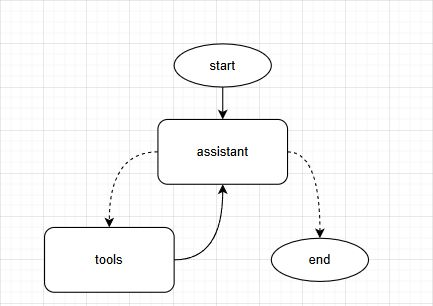

# Travel Assistant
A terminal based travel assistant built using LangGraph, LangChain, and Ollama.  
It helps you plan trips by checking current weather, giving attraction suggestions,
and offering personalized packing tips through natural chat.

---

## Table of Contents
- [APIs](#powered-by-travel-apis)
- [How to Use](#how-to-use)
- [Supported Queries & Commands](#supported-queries--commands)
- [LangGraph Workflow](#langgraph-workflow)
- [Prompt Engineering](#prompt-engineering)

---

## Powered by Travel APIs

This assistant integrates two public APIs:

### OpenWeatherMap API
Used to retrieve:
- **Current weather** for any city
- **5-day weather forecasts** for any city

API Website: https://openweathermap.org/api


### OpenTripMap API
Used to retrieve:
- **Top-rated attractions** in any given city

API Website: https://dev.opentripmap.org/product

---

## How to Use
Follow these steps to get the Travel Assistant running on your machine.

### 1. Clone the Repository

```
git clone https://github.com/TomerSivan/Travel-Assistant
```

### 2. Install Dependencies
Ensure you are using Python 3.10+

```
pip install -r requirements.txt
```

### 3. Install Ollama and Pull a Model
Download Ollama from https://ollama.com and install it locally.
Then, in your terminal, pull a model (Recommended - qwen:4b, Has to support Langchain tools):

```
ollama pull qwen:4b
ollama run qwen:4b
```

### 4. Set Up Environment Variables
Create a .env file in the project root directory with your API keys and selected model:

```
CHAT_MODEL=Qwen3:4b
WEATHER_API_KEY=your_openweathermap_key
OPENTRIPMAP_API_KEY=your_opentripmap_key
```

### 5. Run the Assistant
Finally to start talking to the assistant chatbot via your terminal use:

```
python main.py
```

Or directly run the main file.

---

## Supported Queries & Commands

The Travel Assistant supports natural language queries related to:

Query Type|Example Prompt|Details
-|-|-
Weather|`"What's the weather in Paris?"`|Uses the **OpenWeatherMap API** to retrieve either or both the current weather and a 5-day forecast. This data is integrated into the assistant’s natural language response.
Attractions|`"What are some places to visit in Rome?"`|Uses the **OpenTripMap API** to fetch top attractions for a city. Also calls the weather tool to tailor suggestions (e.g., avoid outdoor attractions if it's raining).
Packing Tips|`"What should I pack for a trip to Tokyo?"`|No single tool is used directly. Instead, the assistant internally calls both **weather** and **attractions** tools to suggest appropriate clothing, gear, and essentials.
Mixed Intent|`"I'm flying to London—what should I see and pack?"`|The assistant chains multiple tools (weather + attractions) and uses them together to provide detailed activity suggestions and overviews as well as a tailored packing list.

The assistant interprets user intent dynamically and will request needed information for tools.

The Travel Assistant supports user commands:

Command|Effect
-|-
"/exit"|Quit the assistant
"/debug"|Toggle debug output
"/think"|Toggle thought display
"/history"|Show full conversation
"/clear"|Clears up the history of the conversation
"/cmds"|List available commands

---

## LangGraph Workflow

The Travel Assistant uses a dynamic, tool-aware conversation loop built with **LangGraph**.

The graph consists of two main nodes and a simple routing condition:

**Nodes:**
- `assistant` - the core LLM node responsible for interpreting the user's message, reasoning, and generating tool calls (if needed).
- `tools` - executes any tools requested by the LLM (e.g. current weather, attractions, etc.) and updates the conversation state.

**Control Flow:**
1. Start at the `assistant` node.
2. The LLM interprets the user's message:
   - If tool calls are needed go to `tools`
   - If not end the conversation
3. The `tools` node executes tool calls and updates the state.
4. After tools are run, control returns to `assistant`.
5. This loop continues until no further tools are required.

Below is a simplified diagram of the Travel Assistant's LangGraph structure:



### Why This Structure?

This design makes the assistant feel responsive to what you ask of it and makes it efficient: 
it checks tools when needed, reacts to their outputs, and knows when to stop.

---
## Prompt Engineering

### Prompting Strategy

The Travel Assistant uses a prompt approach that combines:

- **Zero shot prompting** (clear instructions & no full examples)
- **Minimal in-context guidance** (low level examples via formatting and logic)
- **Role + Persona framing**
- **Clarify behaviour**
- **Reasoning by chain of thought**

### Why This Design?

I went with a zero-shot prompt so it stays lightweight, flexible & easy to maintain. 
Since user input can be vague or move between different tasks, 
I wanted it to rely on build in logic rather than long and detailed examples.

To support this, the prompt also defines:
- A clear persona and tone (helpful, intelligent, professional)
- Instruct to Clarify when unsure, avoid assumptions
- Give logic driven examples (e.g., “if vague, call both weather tools”) instead of full few-shot demos

---

### System Prompt:
#### 1. Adding Date
Adds to the prompt today’s date so the assistant can reason about time related information (especially weather).
```
today = datetime.today().strftime("%A, %B %d, %Y at %I:%M %p")
return f"""Today is {today}.
```

#### 2. Assistant Role
Defines the assistant’s purpose and task queries. 
focusing on helpfulness, intelligence, and travel-related guidance.
```
You are a helpful and intelligent travel assistant. Your role is to support users with travel-related questions, including:
- Weather (current or forecast)
- Local attractions and activities
- Packing advice based on conditions
- General travel tips
```

#### 3. Response Style
Directs the assistant to be structured, clear, and concise and to avoid rambling.
```
Your responses should be:
- Clear and direct
- Structured when helpful (e.g., bullet points or sections)
- Concise when information is missing or unclear
```

#### 4. Tool Use & Reasoning Logic
Defines strict logic rules for when and how to use tools. Promotes modularity, avoids overuse, and enforces dependencies between queries and tool calls.
```
Tool Use & Reasoning Rules:
Use tools only when necessary to improve your response. Always follow these logic dependencies based on what the user asks:
1. If the user asks for **weather**:
    - If they specify **current** or **forecast**, call only the specified tool.
    - If they are vague, call **both** `get_weather_current` and `get_weather_forecast`.
    - Crucial that you only provide weather data, do **not** offer to use non-dependent queries like packing advice, or attractions unless **explicitly asked**.

2. If the user asks for **activities or attractions**, you must check the weather first.
   - Use the weather conditions to decide what to recommend or avoid (e.g., avoid outdoor spots in rain).

3. If the user asks for **packing advice**, you must check **both** the weather and possible attractions via their tools.
   - This ensures packing advice is relevant (e.g., umbrella for rain, hiking shoes if popular attractions include hiking trails).
   - Also mention general essentials like passport, medications, phone, etc.
```

#### 5. Tool Combination
Encourages the assistant to bundle multiple tool calls together when needed for richer responses.
```
You may request multiple tools in a single message when necessary.
- For example: packing advice may require using both the weather and attractions tools together.
```


#### 6. Logic and Thought
Outlines using a clear ching of thought to perform tasks step by step in addition to
reducing unnecessary reasoning loops and prevents the assistant from making up suggestions or sections.
```
When reasoning about multi-step tasks (like packing), break it down step by step and act clearly, 
for example: identify what's needed (e.g., weather + attractions), decide on tools, then respond.

Keep <think> sections short (1–2 sentences) and avoid repeating logic.
Don't "But wait" yourself too much, Maintain a short and effective chain of thought by ignoring minor details.
Only include suggestions or sections if the user clearly asked for them, and always base them on actual tool results.
```

#### 7. Conversation Management
Guides the assistant in handling ambiguous input or unsupported input which it has no tools for while maintaining professionalism.
```
Conversation Guidance:
- Stay grounded in **verifiable facts** and **tool results**.
- If asked about a **factual topic outside your tool access** (e.g., whether a fruit grows in a region):
    - Do **not guess or invent details**.
    - Say: “I don’t have direct data on that,” and offer information that can be provided via the tools at your disposal (e.g, Checking the current weather of a city).
- Ask for clarification if user input is vague or incomplete.
- Always double check if what you are providing was clearly requested, and always base provided info on real information.
- Maintain a professional, helpful, and efficient tone.
```

---
